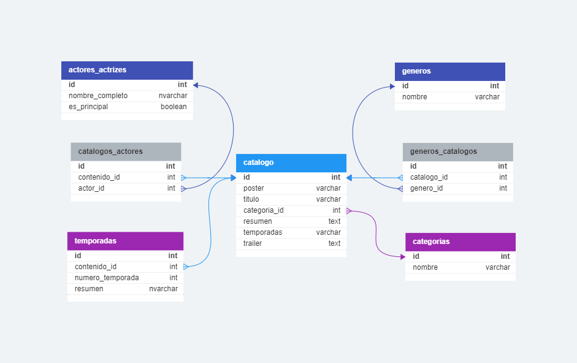

# TRAILERFLIX

## Índice

  - [Introducción](#introducción)
  - [Especificaciones](#especificaciones)
  - [Instalación](#instalación)
  - [Configuración](#configuración)
  - [Recursos](#recursos)
  - [Uso](#uso)

## Introducción

  **TrailerFlix** es una pequeña solución informática que permite registrar y recuperar datos de contenidos visuales, como películas, series, etc. Esta aplicación ha sido diseñada y construida siguiendo una arquitectura de API REST, desarrollada bajo las restricciones y recomendaciones de REST, y haciendo uso de buenas prácticas de programación.
  Modelo relacional de SQL:

  

## Especificaciones

  Especificaciones y requisitos necesarios para utilizar la API:

  - Especificaciones:
    - "Autor": "Martinez Marcos"
    - "Servidor por defecto": "http://localhost:3016"
    - "Visual Studio Code": "1.83.0"
    - "GIT": "2.40.1"
    - "Lenguaje": "JavaScript"
    - "S.O": "Windows 10pro"
  - Requerimientos :
    - "Node JS": "18.17.0"
    - "MySQL": "8.0.30"
  - Scripts:
    - "cargar": "Carga los contenidos del JSON en la DDBB",
    - "dev": "Inicia el servidor con nodemon",
     - "start": "Inicia el servidor con node"
  - Dependencias:
    - "dotenv": "16.3.1",
    - "express": "4.18.2",
    - "mysql2": "3.6.0",
    - "sequelize": "6.32.1"
  - Dependencies de desarrollo:
    - "eslint": "8.50.0",
    - "nodemon": "3.0.1"

## Instalación
  
  #### ⚠ Importante¡¡¡
    Recuerda que estas instrucciones son para Windows. Si estás utilizando otro sistema operativo, asegúrate de seguir los procedimientos adecuados para tu sistema.


  Pasos para la instalación, ejecución de la API y preparación de la base de datos.
  
  Clonar el repositorio e instalar dependencias.
    ***Recuerde que todo esto es para windows.***, en caso de usar otro sistema operativo utilice la manera correcta para el sistema.

  ```shell
  # Clona el repositorio  
  git clone https://github.com/Martinez-Marcos/API-Rest-NodeJS-MYSQL.git
  cd API-Rest-NodeJS-MYSQL

  # Instala las dependencias
  npm install
  ```
## Configuración

  #### Variables de entorno:
  Debe hacer una copia del archivo .env.dist y renombrarlo como .env. En cuanto a su contenido, necesitas asignar valores a las siguientes variables:

  ``` JavaScript
  SERVER_PORT=3001
  SERVER_HOST=localhost

  DATABASE=trailerflix
  DBUSER=TU-USUARIO-DE-MYSQL
  PASSWORD=TU-PASSWORD-DE-MYSQL
  ```
  #### Creación de base de datos:

  Debe ejecutar el archivo SQL trailerflix.sql que se encuentra en la carpeta database del proyecto. Realiza la ejecución completa con los siguientes comandos:

  ```shell
  #Ingresar a la carpeta y ejecutar el archivo.

  cd database
  cat trilerflix.sql | mysql -u usuario -p

  #Reemplaze "usuario" por su nombre de usuario de MySQL

  ```

  Solicitará la contraseña de la base de datos, y una vez ingresada, ejecutará el archivo y creará la base de datos. 
  ***También puede ejecutarlo desde MySQL Workbench si lo prefiere.***

  #### Carga de la base de datos:
  Una vez creada la base de datos en el paso anterior, puede proceder a cargar los datos. 
  Ejecute el siguiente script para cargar los datos desde el archivo trailerflix.json:

  ```shell
    #cargar base de datos
    npm run cargar
  ```

 #### Errores y formatos
    La comprobación de errores y formato se realiza mediante el comando npm run eslint, utilizando Eslint. Para visualizar los errores en tiempo de escritura, debes tener instalada la extensión de Eslint en Visual Studio Code.

## Recursos

  ### Módulo Categoría

  Este módulo permite leer el registro de categorías disponibles.

  #### Métodos HTTP
  | Tipo     | URI                                     | Descripción |
  |----------|-----------------------------------------|-------------|
  | GET      |  http://localhost:3001/categorias        | Obtiene información sobre todas las categorías existentes |

  ### Módulo Catálogo

  Este módulo permite la gestión del catálogo de contenidos. Ofrece funciones para agregar o leer un contenido y permite visualizar contenidos filtrados por diferentes criterios de búsqueda.

  #### Métodos HTTP
  | Tipo     | URI                                            | Descripción |
  |----------|------------------------------------------------|-------------|
  | POST     |  http://localhost:3001/catalogo    | Crea un registro con los datos que recibe |
  | GET      |  http://localhost:3001/catalogo    | Obtiene todos los registro |
  | GET      |  http://localhost:3001/catalogo/:id  | Obtiene un registro específico |
  | GET      | http://localhost:3001/catalogo/nombre/:nombre | Obtiene los registro que contengan un nombre específico  |
  | GET      | http://127.0.0.1:3001/catalogo/genero/:genero | Obtiene los registro que contengan un genero específico |
  | GET      | http://127.0.0.1:3001/catalogo/categoria/:categoria| Obtiene los registro que contengan una categoría específica |


## Uso

### Modulo categoría. 

  #### Método GET:
  - URI: http://localhost:3001/categorias

  - Response:
      ``` json
          [
            {
              "id":1,
              "nombre":"Serie"
            },
            {
              "id":2,
              "nombre":"Película"
            }
          ]
      ```
    - Código HTTP: **200** *categorias*
    - Código HTTP: **500** *message: Error al obtener las categorías.*

### Modulo catálogo.

  #### Método POST:
  
  - URI: http://localhost:3001/catalogo

  - Parámetros requeridos del BODY:

  | Parametro | Valor | Finalidad |
  |-----------|-------|-----------|
  |   titulo | Avengers |*(tipo: string. Establece el valor del titulo)*| 
  |   categoria | Pelicula | *(tipo: string. Establece el valor de la categoria)*| 
  |   genero | accion, fantasía | *(tipo: string. Busca o crea los generos y los relaciona con el contenido)* |
  |   temporadas | 4 | *(tipo: string. En caso de no ser "N/A" crea la cantidad de  temporadas correspondientes)* |
  |   reparto | Scarlett Johansson, Florence Pugh | *(tipo: string. Busca o crea a los actores y los relaciona  con el contenido)* |
  |   poster | /posters/8.jpg | *(tipo: string. Establece el path y recurso de la imagen)* |
  |   trailer | https://www.youtube.com/embed/BIn8iANwEog | *(tipo: string. Establece la URL del trailer)* |

  - Response:
    - Código HTTP: **201** *message: *message: Contenido creado con exito, payload: contenido*
    - Código HTTP: **400** *message: Faltan datos necesarios*
    - Código HTTP: **500** *message: Error al cargar la pelicula, error*

  #### Método GET:

  - URI: http://localhost:3001/catalogo

  - Response:
    ``` json
      {
      "id": 1,
      "poster": "/posters/1.jpg",
      "titulo": "The Crown",
      "categoria": "Serie",
      "genero": "Drama, Hechos verídicos",
      "resumen": "Este drama narra las rivalidades políticas y el romance de la reina Isabel II, así como los sucesos que moldearon la segunda mitad del siglo XX.",
      "temporadas": "4",
      "reparto": "Claire Fox, Olivia Colman, Matt Smith, Tobias Menzies, Vanesa Kirby, Helena Bonham Carter"
      },
      {
      "id": 2,
      "poster": "/posters/2.jpg",
      "titulo": "Riverdale",
      "categoria": "Serie",
      "genero": "Drama, Misterio, Ficción",
      "resumen": "El paso a la edad adulta incluye sexo, romance, escuela y familia. Para Archie y sus amigos, también hay misterios oscuros.",
      "temporadas": "5",
      "reparto": "Lili Reinhart, Casey Cott, Camila Mendes, Marisol Nichols, Madelaine Petsch, Mädchen Amick"
      }
    ```

  - Código HTTP: **200** *catalogoParseado*
  - Código HTTP: **400** *message: No hay contenidos*
  - Código HTTP: **500** *message: Error al obtener el catálogo., error*
    
  - Nota: *La respuesta mostrará tantos contenidos como haya en la DDBB.*

  #### Método GET:

  - URI: http://localhost:3001/catalogo/:id 

  - Parámetro obligatorio de tipo URL:
  
  | Parametro | Valor | Finalidad |
  |-----------|-------|-----------|
  |   id | 3 |*(tipo: integer. Indica el código del contenido que se requiere obtener)*|

  - Response:
    ``` json
      {
        "id": 3,
        "poster": "/posters/3.jpg",
        "titulo": "The Mandalorian",
        "categoria": "Serie",
        "genero": "Ciencia Ficción, Fantasía",
        "resumen": "Ambientada tras la caída del Imperio y antes de la aparición de la Primera Orden, la serie sigue los pasos de un pistolero solitario en las aventuras que protagoniza en los confines de la galaxia, donde no alcanza la autoridad de la Nueva República.",
        "temporadas": "2",
        "reparto": "Pedro Pascal, Carl Weathers, Misty Rosas, Chris Bartlett, Rio Hackford, Giancarlo Esposito",
        "trailer": "https://www.youtube.com/embed/aOC8E8z_ifw"
      },
    ```

  - Código HTTP: **200** *contenido*
  - Código HTTP: **400** *message: No se ah encontrado ningun contenido con ese id*
  - Código HTTP: **500** *message: Error al obtener el contenido., error*

  #### Método GET:

  - URI: http://localhost:3001//catalogo/nombre/:nombre

  - Parámetro obligatorio de tipo URL:
  
  | Parametro | Valor | Finalidad |
  |-----------|-------|-----------|
  |   nombre | Mandalorian |*(tipo: string. Indica el nombre del titulo del contenido que se requiere obtener)*|

  - Response:
    ``` json
      {
        "id": 3,
        "poster": "/posters/3.jpg",
        "titulo": "The Mandalorian",
        "categoria": "Serie",
        "genero": "Ciencia Ficción, Fantasía",
        "resumen": "Ambientada tras la caída del Imperio y antes de la aparición de la Primera Orden, la serie sigue los pasos de un pistolero solitario en las aventuras que protagoniza en los confines de la galaxia, donde no alcanza la autoridad de la Nueva República.",
        "temporadas": "2",
        "reparto": "Pedro Pascal, Carl Weathers, Misty Rosas, Chris Bartlett, Rio Hackford, Giancarlo Esposito",
        "trailer": "https://www.youtube.com/embed/aOC8E8z_ifw"
      }
    ```
  - Código HTTP: **200** *contenido*
  - Código HTTP: **400** *message: No se ah encontrado ningun contenido con ese nombre*
  - Código HTTP: **500** *message: Error al obtener el contenido., error*

  - Nota: *La respuesta mostrará todos los contenidos que cumplan con ese criterio.*

  #### Método GET:

  - URI: http://127.0.0.1:3001/catalogo/genero/:genero

  - Parámetro obligatorio de tipo URL:

  | Parametro | Valor | Finalidad |
  |-----------|-------|-----------|
  |   genero | fantasia |*(tipo: string. Indica el nombre del genero del contenido que se requiere obtener)*|

  - Response:
    ``` json
      {
        "id": 3,
        "poster": "/posters/3.jpg",
        "titulo": "The Mandalorian",
        "categoria": "Serie",
        "genero": "Ciencia Ficción, Fantasía",
        "resumen": "Ambientada tras la caída del Imperio y antes de la aparición de la Primera Orden, la serie sigue los pasos de un pistolero solitario en las aventuras que protagoniza en los confines de la galaxia, donde no alcanza la autoridad de la Nueva República.",
        "temporadas": "2",
        "reparto": "Pedro Pascal, Carl Weathers, Misty Rosas, Chris Bartlett, Rio Hackford, Giancarlo Esposito",
        "trailer": "https://www.youtube.com/embed/aOC8E8z_ifw"
      },
      {
          "id": 9,
          "poster": "/posters/9.jpg",
          "titulo": "Juego de tronos",
          "categoria": "Serie",
          "genero": "Aventura, Fantasía, Drama",
          "resumen": "En un mundo fantástico y en un contexto medieval varias familias, relativas a la nobleza, se disputan el poder para dominar el territorio ficticio de Poniente (Westeros) y tomar el control de los Siete Reinos desde el Trono de Hierro, lugar donde el rey ejerce el poder.",
          "temporadas": "8",
          "reparto": "Emilia Clarke, Lena Headey, Sophie Turner, Kit Harington, Peter Dinklage, Nikolaj Coster-Waldau"
      }
    ```

  - Código HTTP: **200** *contenido*
  - Código HTTP: **400** *message: No se ah encontrado ningun contenido con ese genero*
  - Código HTTP: **500** *message: Error al obtener el contenido., error*

  - Nota: *La respuesta mostrará todos los contenidos que cumplan con ese criterio.*

  #### Método GET:

  - URI: http://127.0.0.1:3001/catalogo/categoria/:categoria

  - Parámetro obligatorio de tipo URL:

  | Parametro | Valor | Finalidad |
  |-----------|-------|-----------|
  |   categoria | serie |*(tipo: string. Indica el nombre de la categoría del contenido que se requiere obtener)*|

  - Response:
    ``` json
      {
        "id": 3,
        "poster": "/posters/3.jpg",
        "titulo": "The Mandalorian",
        "categoria": "Serie",
        "genero": "Ciencia Ficción, Fantasía",
        "resumen": "Ambientada tras la caída del Imperio y antes de la aparición de la Primera Orden, la serie sigue los pasos de un pistolero solitario en las aventuras que protagoniza en los confines de la galaxia, donde no alcanza la autoridad de la Nueva República.",
        "temporadas": "2",
        "reparto": "Pedro Pascal, Carl Weathers, Misty Rosas, Chris Bartlett, Rio Hackford, Giancarlo Esposito",
        "trailer": "https://www.youtube.com/embed/aOC8E8z_ifw"
      },
      {
          "id": 5,
          "poster": "/posters/5.jpg",
          "titulo": "Gambito de Dama",
          "categoria": "Serie",
          "genero": "Drama, Ficción, Sucesos",
          "resumen": "En los cincuenta, una joven de un orfanato descubre que tiene un increíble don para el ajedrez y recorre el arduo camino a la fama mientras lucha contra las adicciones.",
          "temporadas": "1",
          "reparto": "Anya Taylor-Joy, Thomas Brodie-Sangster, Harry Melling, Moses Ingram, Chloe Pirrie, Janina Elkin"
      }
    ```
  - Código HTTP: **200** *contenido*
  - Código HTTP: **400** *message: No se ah encontrado ningun contenido con esa categoría*
  - Código HTTP: **500** *message: Error al obtener el contenido., error*

  - Nota: *La respuesta mostrará todos los contenidos que cumplan con ese criterio.*